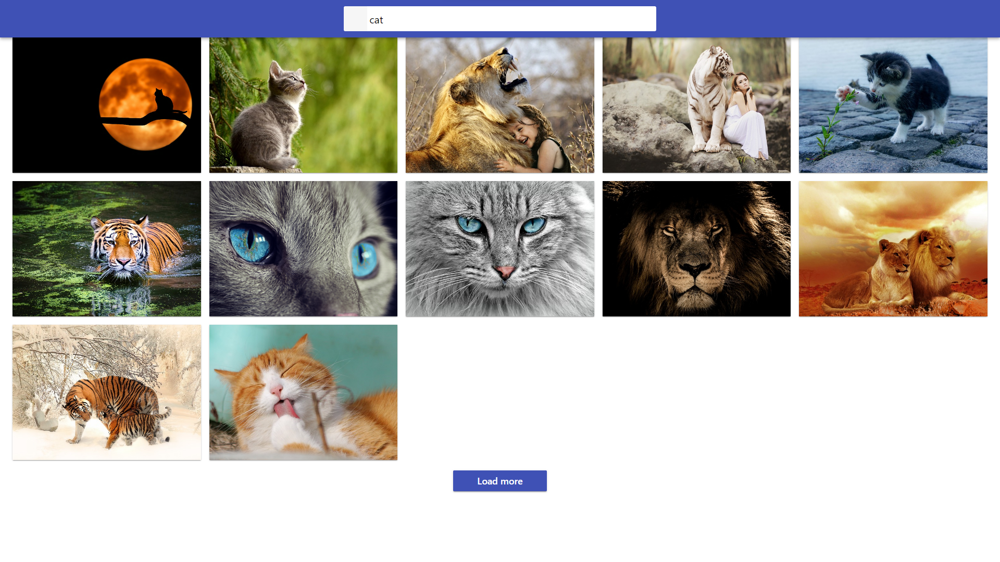

# Hi, I'm react project "Image-finder"
The project allows you to search for images by keyword.

The aim of the project was to create an application enabling simple and quick search for images by keyword.

The application uses the public image search service Pixabay API.

The application allows you to load a maximum of 12 photos on one page, but you can load more using the "Load more" button.

This application consolidates the material from the online course.
This project was created with
[Create React App] (https://github.com/facebook/create-react-app)

Hooks were used in the project.

## Technologies
- "JavaScript"
- "react": "^18.1.0",
- "node": "v18.16.1",
- "react-dom": "^18.1.0",
- "axios": "^1.6.1",
- "components": "^0.1.0",
- "eslint-config-react-app": "^7.0.1",
- "prop-types": "^15.8.1",
- "react-loader-spinner": "^5.4.5",

## Setup
- git clone - clone the remote repository to your computer locally;
- npm install - create dependencies;
- npm start - run the application, access to it will be at localhost:3000;